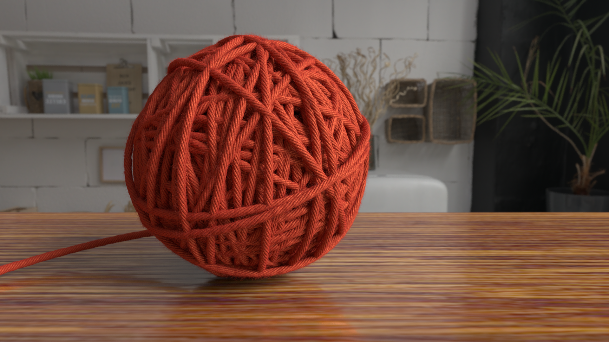
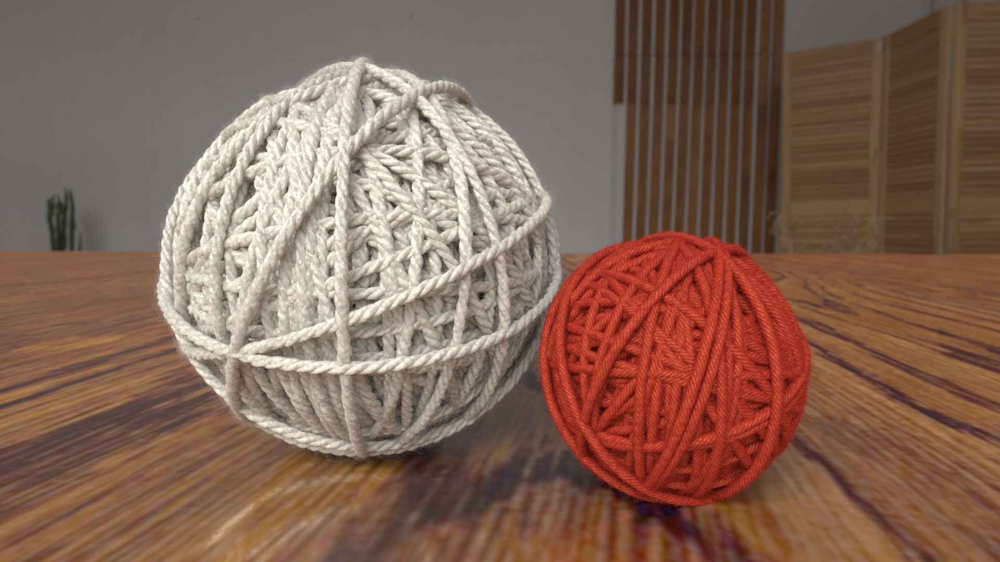

# Yarn Ball Rendering


<p align="center">   </p>


Procedural rendering project that builds and renders a realistic yarn ball using the RenderMan Python API and OSL shaders.


#


### Features:

Geometry: 
- many torus instances (dense inner core + looser outer layer) with non-repeating transforms (irrational constants + trig + jitter) to avoid visible patterns

Displacement (OSL): 
- two contra-rotating spiral height maps (strand-scale + microfiber-scale) blended with three octaves of Perlin noise (low/mid/high) to produce signed displacement that follows the yarn twist

Shading (BRDF): 
- PxrSurface-based fibrous material - procedural spiral+noise colour variation, specular roughness modulation, subtle subsurface scattering and shader fuzz

Fuzz (geometry): 
- sampled torus roots → cubic-curve hairs (10 control points) with per-strand randomness, rendered with PxrMarschnerHair for realistic sheen

Scene: 
- HDRI dome + rect key light, wood plane, shallow DOF; increase shading/curve samples for close-ups


#

### Dependencies
- RenderMan
- Open Shading Language (OSL)
- Python
- numpy

#

### Run instructions

1. Run the individual image renders:    
    ```bash
    python3 render_image_ONE.py
    python3 render_image_TWO.py
    ```
##### Notes
The following settings were changed after the final images were rendered, in order to enable faster rendering:

- shading rate: set to 10 now from previouly 2
- pixel variance: set to 0.1 now from previously 0.01
- maxsamples: disabled
- pixel filter: disabled